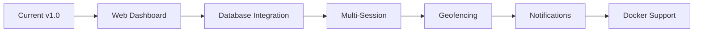

# GhostTrack

<div align="center">


[


](https://github.com/alonebeast002/GhostTracker)
[


](https://www.python.org/)
[


](LICENSE)
[


](https://github.com/alonebeast002/GhostTracker)
[


](https://github.com/alonebeast002/GhostTracker/stargazers)

**Advanced Location Intelligence Tool for Security Research and OSINT**

[Features](#features) • [Installation](#installation) • [Usage](#usage) • [Demo](#demo) • [Contributing](#contributing)

</div>

---

## Overview

<div align="center">
  
</div>

GhostTrack is a sophisticated geolocation tracking framework designed for authorized security testing, penetration testing, and OSINT investigations. Features real-time GPS tracking, automated tunneling, and comprehensive device fingerprinting.

---

## Features

<table>
<tr>
<td width="50%">

### Core Capabilities
- Real-time GPS coordinate tracking
- Google Maps visualization
- Automated HTTPS tunneling
- Device fingerprinting
- Persistent logging
- Cross-platform support

</td>
<td width="50%">

### Technical Stack
- Python 3.x backend
- HTML5/JavaScript frontend
- Cloudflared tunneling
- Zero-config setup
- CLI-based interface

</td>
</tr>
</table>

---

## Demo

<div align="center">

### Live Tracking Interface


### Terminal Output

```bash
$ GhostTracker

[+] Starting GhostTrack Server...
[+] Server running on http://localhost:8080
[+] Cloudflare tunnel active
[+] Share this URL: https://random-xyz.trycloudflare.com
[+] Waiting for connections...
```

### Captured Data Sample


</div>

---

## Installation

### Quick Setup

```bash
# Clone repository
git clone https://github.com/alonebeast002/GhostTracker.git

# Navigate to directory
cd GhostTrack

# Run installer
chmod +x setup.sh
./setup.sh
```

<div align="center">
  
</div>

### Verify Installation

```bash
GhostTracker --version
```

---

## Usage

### Start Server

```bash
GhostTracker
```

<div align="center">

**Server Workflow**

```
┌─────────────┐      ┌──────────────┐      ┌─────────────┐
│   Python    │─────▶│  Cloudflared │─────▶│   Public    │
│   Server    │      │    Tunnel    │      │     URL     │
└─────────────┘      └──────────────┘      └─────────────┘
      │                                            │
      │                                            │
      ▼                                            ▼
┌─────────────┐                            ┌─────────────┐
│    Logs     │                            │   Target    │
│   Storage   │◀───────────────────────────│   Device    │
└─────────────┘                            └─────────────┘
```

</div>

### Monitor Data

```bash
# Real-time monitoring
tail -f captured_locations.txt

# View all captures
cat captured_locations.txt
```

---

## Project Structure

```
GhostTrack/
│
├── 📄 GhostTracker.py          # Core server logic
├── 🌐 index.html               # Frontend interface
├── 🔧 setup.sh                 # Installation script
├── 📝 captured_locations.txt   # Log file
├── 📖 README.md
└── 📜 LICENSE
```

---

## Screenshots

<div align="center">

### Terminal Interface


### Web Interface


### Location Map


</div>

---

## Security Notice

<div align="center">

⚠️ **AUTHORIZED USE ONLY** ⚠️

</div>

### Legal Use Cases
✅ Authorized penetration testing  
✅ Security research with consent  
✅ Red team operations  
✅ Educational purposes  

### Prohibited Activities
❌ Unauthorized tracking  
❌ Stalking or harassment  
❌ Privacy law violations  
❌ Malicious activities  

---

## Troubleshooting

<details>
<summary><b>Command not found</b></summary>

```bash
source ~/.bashrc
# or for zsh
source ~/.zshrc
```
</details>

<details>
<summary><b>Port already in use</b></summary>

```bash
lsof -i :8080
kill -9 <PID>
```
</details>

<details>
<summary><b>Cloudflared issues</b></summary>

```bash
./cloudflared --version
rm cloudflared
./setup.sh
```
</details>

<details>
<summary><b>Browser permission denied</b></summary>

- Ensure HTTPS tunnel is active
- Allow location when prompted
- Try Chrome or Firefox
</details>

---

## Contributing

<div align="center">

Contributions are welcome! 

[


](https://github.com/alonebeast002/GhostTracker/graphs/contributors)
[


](https://github.com/alonebeast002/GhostTracker/network/members)
[


](https://github.com/alonebeast002/GhostTracker/issues)

</div>

### How to Contribute

1. Fork the repository
2. Create feature branch (`git checkout -b feature/improvement`)
3. Commit changes (`git commit -m 'Add feature'`)
4. Push to branch (`git push origin feature/improvement`)
5. Open Pull Request

---

## Roadmap

<div align="center">



</div>

- [ ] Web dashboard for analytics
- [ ] Database integration (SQLite/PostgreSQL)
- [ ] Multi-session support
- [ ] Geofencing and alerts
- [ ] Email/SMS notifications
- [ ] Docker containerization
- [ ] REST API
- [ ] Mobile app

---

## Star History

<div align="center">

[


](https://star-history.com/#alonebeast002/GhostTracker&Date)

</div>

---

## Support

<div align="center">

**Found this useful? Give it a ⭐**

[


](https://github.com/alonebeast002/GhostTracker/stargazers)
[


](https://github.com/alonebeast002/GhostTracker/watchers)

### Contact & Social

[


](https://github.com/alonebeast002)
[


](https://twitter.com/alonebeast002)
[


](https://discord.gg/yourinvite)

</div>

---

## License

<div align="center">

MIT License - Copyright (c) 2024 alonebeast002

See [LICENSE](LICENSE) file for details

</div>

---

## Disclaimer

<div align="center">

```
╔══════════════════════════════════════════════════════════════╗
║                                                              ║
║  THIS SOFTWARE IS FOR EDUCATIONAL AND RESEARCH PURPOSES ONLY ║
║                                                              ║
║  Unauthorized use may violate federal, state, and local laws ║
║  Users assume all legal responsibility for their actions     ║
║  The developer assumes no liability for misuse               ║
║                                                              ║
║             USE RESPONSIBLY AND ETHICALLY                    ║
║                                                              ║
╚══════════════════════════════════════════════════════════════╝
```

</div>

---

<div align="center">

**Made with ❤️ by [alonebeast002](https://github.com/alonebeast002)**

**If you find this project useful, consider giving it a ⭐!**

</div>
